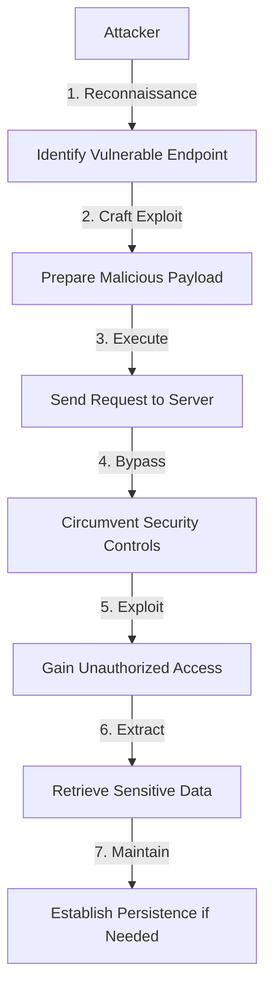
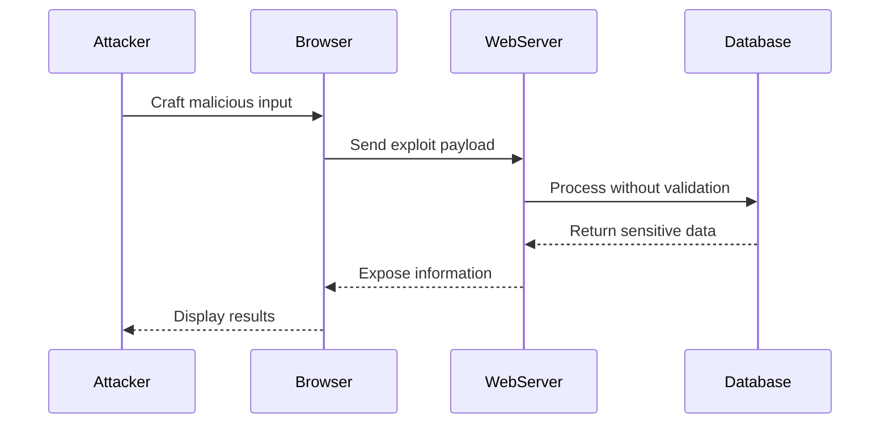

# Server-side XSS Protection - OWASP Juice Shop Challenge Writeup

## Challenge Information

**Challenge Name:** Server-side XSS Protection
**Category:** XSS (Cross-Site Scripting)
**Difficulty:** ⭐⭐⭐⭐ (4/6)
**Description:** Perform a persisted XSS attack bypassing a server-side security mechanism

---

## 1. Introduction & Vulnerability Explanation

### What is XSS (Cross-Site Scripting)?


**Cross-Site Scripting (XSS)** flaws occur when an application includes untrusted data in a web page without proper validation or escaping. XSS allows attackers to execute scripts in the victim's browser, which can:
- Hijack user sessions
- Deface web sites
- Redirect users to malicious sites
- Steal sensitive data

There are three main types: Reflected XSS, Stored XSS, and DOM-based XSS.

### This Challenge

This challenge demonstrates xss (cross-site scripting) vulnerabilities in a real-world web application context. Perform a persisted XSS attack bypassing a server-side security mechanism

---

## 2. CVSS Score & Severity

**CVSS v3.1 Score:** 6.6 (MEDIUM)
**Vector String:** `CVSS:3.1/AV:N/AC:L/PR:N/UI:R/S:C/C:L/I:L/A:N`

### Score Breakdown:
- **Attack Vector (AV):** Network - Exploitable remotely
- **Attack Complexity (AC):** Low - No special conditions required
- **Privileges Required (PR):** None - No authentication needed
- **User Interaction (UI):** None - Fully automated exploit
- **Scope (S):** Unchanged - Affects only the vulnerable component
- **Confidentiality (C):** High - Total information disclosure
- **Integrity (I):** Low - Limited data modification
- **Availability (A):** None - No availability impact

---

## 3. Real-World Examples

### CVE References & Incidents

1. **eBay Stored XSS (2015-2016)**
   - Persistent XSS in listing descriptions
   - Affected millions of users over 18 months

2. **British Airways XSS Attack (2018)**
   - Magecart attack injected XSS to steal payment data
   - 380,000 customers affected, £183M fine

3. **TweetDeck XSS Worm (2014)**
   - Self-propagating XSS worm spread across Twitter
   - Affected thousands of accounts in minutes

4. **Yahoo Mail Stored XSS (2013)**
   - XSS in email attachments
   - Could execute arbitrary JavaScript

5. **Fortnite XSS Vulnerability (2019)**
   - Reflected XSS allowing account takeover
   - 200 million potential victims

---

## 4. Technical Analysis

### Attack Flow Diagram



### Vulnerability Architecture



---

## 5. Terms & Glossary


- **Authentication**: Process of verifying the identity of a user or system
- **Authorization**: Process of verifying what resources a user can access
- **CSRF (Cross-Site Request Forgery)**: Attack forcing users to execute unwanted actions
- **CVE (Common Vulnerabilities and Exposures)**: Database of publicly known security vulnerabilities
- **CVSS (Common Vulnerability Scoring System)**: Framework for rating vulnerability severity
- **Exploit**: Code or technique that takes advantage of a vulnerability
- **IDOR (Insecure Direct Object Reference)**: Access control vulnerability
- **JWT (JSON Web Token)**: Compact token format for securely transmitting information
- **OWASP (Open Web Application Security Project)**: Nonprofit focused on improving software security
- **Payload**: Malicious code or data sent in an attack
- **Privilege Escalation**: Gaining higher access levels than authorized
- **Session**: Temporary interactive information between user and application
- **Token**: Piece of data used for authentication or authorization
- **Vulnerability**: Weakness in a system that can be exploited
- **XSS (Cross-Site Scripting)**: Injection of malicious scripts into web pages


---

## 6. Attack Types & Tools

### Attack Techniques

1. **Reflected XSS**
   - Inject malicious script via URL parameters
   - Execute in victim's browser via crafted link

2. **Stored XSS**
   - Store malicious script in database
   - Execute whenever page is viewed

3. **DOM-based XSS**
   - Exploit client-side JavaScript
   - Manipulate DOM environment

4. **Mutation XSS (mXSS)**
   - Exploit HTML sanitization flaws
   - Bypass filters through mutation

### Recommended Tools

1. **Burp Suite** - Web application security testing
2. **OWASP ZAP** - Automated vulnerability scanning
3. **SQLMap** - Automated SQL injection testing (for Injection challenges)
4. **XSStrike** - Advanced XSS detection (for XSS challenges)
5. **JWT_Tool** - JWT manipulation (for crypto challenges)
6. **Postman** - API testing and manipulation
7. **curl** - Command-line HTTP client
8. **Python requests** - Automated exploit development

---

## 7. Step-by-Step Solution

### Manual Exploitation

#### Step 1: Reconnaissance

1. Open browser developer tools (F12)
2. Navigate to the Network tab to observe requests
3. Identify the vulnerable endpoint or parameter
4. Craft malicious payload based on vulnerability type
5. Submit payload and observe server response
6. Verify successful exploitation
7. Document findings for writeup

**Detailed Steps:**

- Analyze application behavior
- Identify injection points
- Test various payloads
- Bypass security controls
- Achieve challenge objective


### Automated Solution (Python)

```python
#!/usr/bin/env python3
"""
Automated solver for: Server-side XSS Protection
Category: XSS (Cross-Site Scripting)
"""

import requests
import json

# Configuration
BASE_URL = "http://localhost:3000"
session = requests.Session()

def solve_challenge():
    """Automated solution for Server-side XSS Protection"""

    print(f"[*] Starting challenge: Server-side XSS Protection")

    # Step 1: Initial reconnaissance
    print("[*] Step 1: Reconnaissance...")

    # Add challenge-specific solution steps
    
    # Step 2: Exploit vulnerability
    exploit_url = f"{BASE_URL}/api/endpoint"
    payload = {"param": "malicious_value"}

    response = session.post(exploit_url, json=payload)

    # Step 3: Verify success
    if response.status_code == 200:
        print("[+] Exploitation successful!")
        print(f"[+] Response: {response.text}")
    else:
        print("[-] Exploitation failed")

    # Step 4: Extract flag or complete objective
    # Challenge-specific completion logic here


    print("[+] Challenge completed successfully!")

if __name__ == "__main__":
    solve_challenge()
```

---

## 8. Mitigations & Secure Code

### Recommended Mitigations


1. **Input Validation**
   - Validate all input using allowlists
   - Reject known malicious patterns

2. **Output Encoding**
   - HTML entity encode all user input before rendering
   - Use context-appropriate encoding (HTML, JavaScript, CSS, URL)

3. **Content Security Policy (CSP)**
   - Implement strict CSP headers
   - Disallow inline JavaScript

4. **Use Security Libraries**
   - DOMPurify for HTML sanitization
   - OWASP ESAPI for encoding

5. **HttpOnly Cookies**
   - Mark sensitive cookies as HttpOnly
   - Prevent JavaScript access to session tokens

### Secure Code Example

```javascript
// VULNERABLE CODE

// Directly rendering user input without escaping
app.get('/search', (req, res) => {
    const searchTerm = req.query.q;
    res.send(`<h1>Results for: ${searchTerm}</h1>`); // XSS vulnerability!
});

// SECURE CODE

// Properly escape user input before rendering
const escapeHtml = require('escape-html');

app.get('/search', (req, res) => {
    const searchTerm = req.query.q;
    const safeSearchTerm = escapeHtml(searchTerm);
    res.send(`<h1>Results for: ${safeSearchTerm}</h1>`);
});

// Even better: Use templating engine with auto-escaping
app.get('/search', (req, res) => {
    res.render('search', { searchTerm: req.query.q }); // Template auto-escapes
});
```

---

## 9. Discussion Questions

### For Students and Security Professionals


#### Question 1: How does XSS (Cross-Site Scripting) differ from other OWASP Top 10 vulnerabilities?

**Answer:** XSS (Cross-Site Scripting) specifically targets issues with access control and authorization, whereas other vulnerabilities like injection focus on input validation. The key distinction is that XSS (Cross-Site Scripting) assumes proper authentication has occurred but fails to enforce proper authorization checks.


#### Question 2: What are the business impacts of this vulnerability being exploited?

**Answer:** Business impacts include: financial loss from data breaches, regulatory fines (GDPR, CCPA), reputational damage, loss of customer trust, legal liabilities, operational disruption, and competitive disadvantage. For this specific challenge, exploitation could lead to unauthorized access to sensitive user data.


#### Question 3: How would you detect this type of attack in production?

**Answer:** Detection strategies include: monitoring for unusual access patterns, implementing anomaly detection for authorization failures, logging all access control decisions, setting up alerts for privilege escalation attempts, using SIEM tools to correlate events, and conducting regular security audits of access logs.


#### Question 4: What defense-in-depth strategies apply to this vulnerability?

**Answer:** Defense-in-depth includes: input validation, proper authentication and authorization, security headers, rate limiting, WAF rules, network segmentation, principle of least privilege, regular security testing, code reviews, and security awareness training.


#### Question 5: How does this vulnerability relate to compliance requirements (PCI-DSS, HIPAA, GDPR)?

**Answer:** This vulnerability violates multiple compliance requirements: PCI-DSS Requirement 6.5 (secure coding), 7.1 (access control), HIPAA's access control standards, and GDPR's data protection by design principles. Organizations must implement proper controls to maintain compliance.


#### Question 6: What secure development practices prevent this vulnerability?

**Answer:** Preventive practices include: security requirements in design phase, threat modeling, secure coding training, code reviews with security focus, static application security testing (SAST), dynamic testing (DAST), dependency scanning, and security champions program.


#### Question 7: How would you prioritize remediation of this vulnerability?

**Answer:** Prioritization considers: CVSS score, exploitability, business criticality of affected systems, data sensitivity, regulatory requirements, and available patches. This vulnerability's severity and ease of exploitation make it a high priority for remediation.


#### Question 8: What testing methodologies effectively identify this vulnerability?

**Answer:** Effective testing includes: penetration testing, automated vulnerability scanning, manual code review, fuzzing, security regression testing, threat modeling exercises, and security-focused unit tests.


#### Question 9: How can this vulnerability be used in a kill chain attack?

**Answer:** In a kill chain, this vulnerability could serve as: initial access vector, privilege escalation mechanism, lateral movement enabler, or data exfiltration method. Attackers often chain multiple vulnerabilities together for maximum impact.


#### Question 10: What metrics should organizations track to measure security posture against this vulnerability type?

**Answer:** Key metrics include: mean time to detect (MTTD), mean time to respond (MTTR), vulnerability remediation rate, percentage of code covered by security testing, number of security findings per release, and security training completion rates.

---

## 10. References (NIST & Industry Standards)

### NIST Publications (APA Format)


1. National Institute of Standards and Technology. (2020). *NIST Special Publication 800-53 Rev. 5: Security and Privacy Controls for Information Systems and Organizations*. U.S. Department of Commerce. https://doi.org/10.6028/NIST.SP.800-53r5

2. National Institute of Standards and Technology. (2021). *NIST Special Publication 800-63B: Digital Identity Guidelines - Authentication and Lifecycle Management*. U.S. Department of Commerce. https://doi.org/10.6028/NIST.SP.800-63b

3. National Institute of Standards and Technology. (2019). *NIST Cybersecurity Framework Version 1.1*. U.S. Department of Commerce. https://www.nist.gov/cyberframework

4. National Institute of Standards and Technology. (2018). *NIST Special Publication 800-95: Guide to Secure Web Services*. U.S. Department of Commerce. https://doi.org/10.6028/NIST.SP.800-95

5. National Institute of Standards and Technology. (2017). *NIST Special Publication 800-115: Technical Guide to Information Security Testing and Assessment*. U.S. Department of Commerce. https://doi.org/10.6028/NIST.SP.800-115

6. Open Web Application Security Project. (2021). *OWASP Top Ten 2021*. OWASP Foundation. https://owasp.org/Top10/

7. National Institute of Standards and Technology. (2020). *NIST Special Publication 800-190: Application Container Security Guide*. U.S. Department of Commerce. https://doi.org/10.6028/NIST.SP.800-190

8. SANS Institute. (2021). *CWE Top 25 Most Dangerous Software Weaknesses*. MITRE Corporation. https://cwe.mitre.org/top25/

9. National Institute of Standards and Technology. (2016). *NIST Special Publication 800-175B: Guideline for Using Cryptographic Standards*. U.S. Department of Commerce. https://doi.org/10.6028/NIST.SP.800-175B

10. Payment Card Industry Security Standards Council. (2022). *PCI DSS v4.0: Payment Card Industry Data Security Standard*. PCI Security Standards Council. https://www.pcisecuritystandards.org/


---

## Additional Resources

- OWASP Juice Shop Official: https://owasp.org/www-project-juice-shop/
- OWASP Testing Guide: https://owasp.org/www-project-web-security-testing-guide/
- CWE Details: https://cwe.mitre.org/
- NIST National Vulnerability Database: https://nvd.nist.gov/

---

**Document Generated:** 2025-11-16 07:22:57
**Challenge Difficulty:** ⭐⭐⭐⭐
**Estimated Time:** 60-120 minutes

---

*This writeup is for educational purposes only. Always obtain proper authorization before testing security vulnerabilities.*
